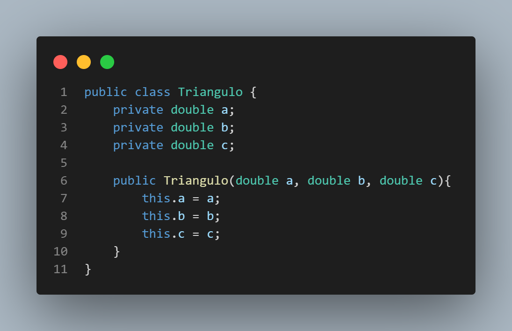

# Object-oriented programming projects and examples
Some projects from the Object-oriented programming class at Federal University of Western Pará - UFOPA.

## Constructor
The constructor methods help in the construction of the object where to define the attributes of the object.
In java, the constructor is done like this:

## Methods
We can call methods as 'actions' or what the object do.

why?
    Reuse of code: the class/object will use its own data:
        If you want something from the object it will give you what you need from the object. 
    Delegation of responsibility